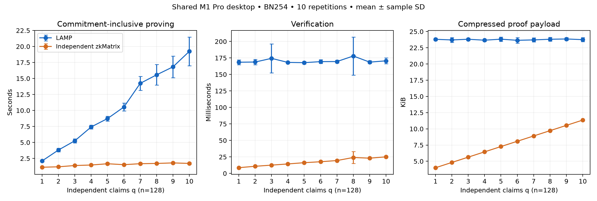
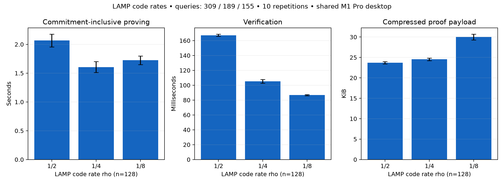
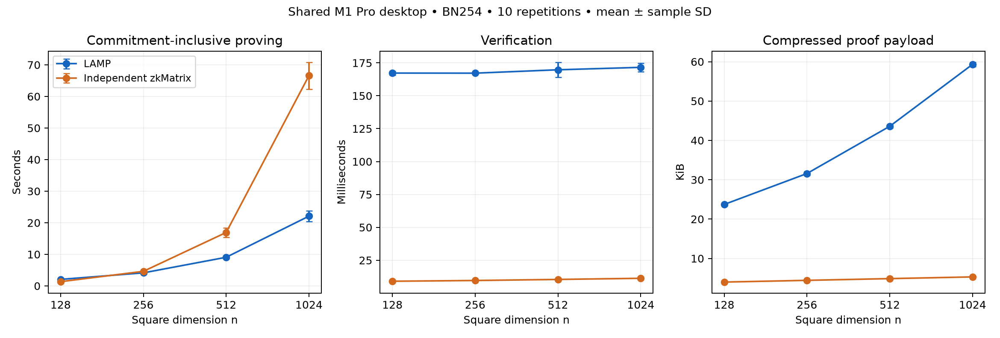

# Local development results — all 300 planned local proofs completed

These are new shared-desktop measurements, not the original paper’s Linux table. The complete three-protocol comparison remains unfinished. All 30 local conditions completed ten verified repetitions each; no missing condition was extrapolated.

## Profile

Apple M1 Pro; macOS; 10 CPUs; 32 GiB; Go 1.26.2; GOMAXPROCS=10. Both implementations use BN254. LAMP uses official `e2d1cae`; zkMatrix is an independent Go implementation of the optimized four-IPA construction and accelerated verification. It is not the authors’ BLS12-381 implementation or a claim of equal security with that curve. LAMP uses rho=1/2 and 309 queries with replacement. An unrelated desktop process uses roughly one CPU; the host is not a controlled quiet benchmark machine.

Both CLIs generate dense matrices over the full BN254 scalar field. zkMatrix uses a deterministic input PRNG with canonical rejection sampling and recorded seeds; LAMP preserves its official cryptographic `SetRandom` generator. Dimensions and workload counts match, but the two schemes do not receive byte-identical A/B matrices. Input generation and computing C=AB are excluded from the normalized proving time. Proof blindings remain cryptographic.

Source tree SHA-256: `c34bd62bee6f07a879d7e4b48d8b9c17e0ca48c34e796425e2bec93ed74e6f93`. The frozen source archive and source manifest are in [comparison-frozen-20260929](../../benchmark/comparison/published_20260929/source/measured/source-manifest.json).

## Completed square profiles

Times are mean ± sample standard deviation over ten verified repetitions. Proving includes all input commitments and online proof work, excludes setup, compilation and computing C=AB. Verification excludes serialization/decoding and the extra decoded-proof check. Every recorded serialized payload was decoded and verified successfully. Statement bytes and keys are separate from proof payload bytes.

| n | Scheme | Repetitions | Full online prove (s) | Verify (ms) | Compressed proof bytes (mean) | Statement bytes |
|---:|---|---:|---:|---:|---:|---:|
| 128 | LAMP | 10 | 2.0662 ± 0.1113 | 167.239 ± 1.480 | 24288.0 | 64 |
| 128 | Independent zkMatrix | 10 | 1.3470 ± 0.1263 | 9.072 ± 0.636 | 4096.0 | 112 |
| 256 | LAMP | 10 | 4.1358 ± 0.3497 | 167.174 ± 0.656 | 32339.2 | 64 |
| 256 | Independent zkMatrix | 10 | 4.6207 ± 0.1875 | 9.628 ± 0.260 | 4544.0 | 112 |
| 512 | LAMP | 10 | 9.0708 ± 0.4573 | 169.738 ± 5.790 | 44633.6 | 64 |
| 512 | Independent zkMatrix | 10 | 16.9261 ± 1.4706 | 10.436 ± 0.158 | 4992.0 | 112 |
| 1024 | LAMP | 10 | 22.0986 ± 1.7448 | 171.588 ± 3.158 | 60742.4 | 64 |
| 1024 | Independent zkMatrix | 10 | 66.5999 ± 4.2575 | 11.296 ± 0.239 | 5440.0 | 112 |

In these completed profiles, zkMatrix has the smaller mean proving time at n=128, while LAMP has the smaller mean at n=256, n=512 and n=1024. zkMatrix verifies faster and communicates fewer proof bytes. These are measured means for this implementation and host; no missing size is extrapolated.

## Completed independent-claim batch profiles

n=128; LAMP rho=1/2, 309 queries with replacement; ten verified repetitions per condition. Times are mean ± sample standard deviation. Both columns report the complete batch, not a per-claim quotient. q=1 uses the batch path and is distinct from the square profile.

| q | LAMP online prove (s) | zkMatrix online prove (s) | LAMP verify (ms) | zkMatrix verify (ms) | LAMP proof bytes (mean) | zkMatrix proof bytes | zkMatrix statement bytes |
|---:|---:|---:|---:|---:|---:|---:|---:|
| 1 | 2.110 ± 0.145 | 1.127 ± 0.079 | 168.530 ± 3.699 | 8.716 ± 0.111 | 24377.6 | 4100 | 112 |
| 2 | 3.818 ± 0.288 | 1.194 ± 0.068 | 168.814 ± 4.062 | 10.794 ± 1.120 | 24275.2 | 4936 | 224 |
| 3 | 5.256 ± 0.310 | 1.394 ± 0.089 | 174.367 ± 21.895 | 12.564 ± 0.794 | 24384.0 | 5772 | 336 |
| 4 | 7.423 ± 0.298 | 1.473 ± 0.031 | 168.245 ± 1.147 | 14.359 ± 0.249 | 24236.8 | 6608 | 448 |
| 5 | 8.734 ± 0.375 | 1.671 ± 0.152 | 167.864 ± 1.781 | 16.263 ± 0.513 | 24396.8 | 7444 | 560 |
| 6 | 10.540 ± 0.606 | 1.528 ± 0.042 | 169.420 ± 2.830 | 17.702 ± 0.210 | 24217.6 | 8280 | 672 |
| 7 | 14.239 ± 1.090 | 1.679 ± 0.147 | 169.545 ± 2.051 | 19.509 ± 0.170 | 24281.6 | 9116 | 784 |
| 8 | 15.567 ± 1.608 | 1.720 ± 0.060 | 177.951 ± 28.845 | 24.139 ± 8.999 | 24384.0 | 9952 | 896 |
| 9 | 16.814 ± 1.699 | 1.802 ± 0.065 | 168.656 ± 2.078 | 23.103 ± 0.330 | 24428.8 | 10788 | 1008 |
| 10 | 19.235 ± 2.250 | 1.724 ± 0.160 | 170.640 ± 4.440 | 25.127 ± 0.234 | 24320.0 | 11624 | 1120 |

LAMP statement bytes are 64 at every q. In this n=128 batch grid, zkMatrix has smaller mean proving time, verification time and proof payload at every measured q. LAMP proof payload and verification time remain approximately stable across q, while its proving work increases. The zkMatrix payload grows with q. These observations apply to this host, parameters and implementations.

## Completed LAMP code-rate profiles

n=128; ten verified square proofs per row. The query count changes with rho; these are LAMP profiles, not equivalent code-rate settings for zkMatrix. Each recorded constraint count matches the supplied paper table.

| rho | Encoded N | Queries | Constraints | Online prove (s) | Verify (ms) | Proof bytes (mean) |
|---|---:|---:|---:|---:|---:|---:|
| 1/2 | 256 | 309 | 167,065 | 2.066 ± 0.111 | 167.239 ± 1.480 | 24288.0 |
| 1/4 | 512 | 189 | 107,503 | 1.606 ± 0.095 | 105.248 ± 2.393 | 25120.0 |
| 1/8 | 1024 | 155 | 95,917 | 1.723 ± 0.076 | 86.734 ± 0.822 | 30713.6 |

At these measured parameters, rho=1/4 has the smallest mean online proving time; rho=1/8 has the smallest mean verification time and a larger proof payload. Lower code rate does not uniformly reduce every cost.

## Accounting, interruption and remaining scope

- Square: 80 verified proofs, 44 completed commands. Batch: 200 verified proofs, 110 completed effective commands. Additional rates: 20 verified proofs, 20 completed commands. Total: 300 proofs, 30 conditions, 174 completed effective commands.
- The GitHub source check interrupted the original batch command 79. Public HEAD/master matched the already reflected e2d1cae revision. The original 78 completed commands (168 proofs) were preserved, and the remaining 32 commands ran in a new directory with the same frozen binaries/source/host/config. The interrupted attempt is excluded. Keep both original and continuation directories when transferring data.
- Setup is shared across ten zkMatrix repetitions in each process; LAMP performs setup in each one-row process. Peak RSS covers the whole process including setup and input generation. It is not an isolated prover-memory measurement. Setup sample counts and proofs per process are explicit in the detailed tables.
- Large n=2048..8192 and the full sequence-1024 workload still require the common Linux host.
- The GPT-2 zkMatrix baseline proves the actual graph generator’s 36 matrix products, grouped by equal rectangular shape. It does not certify cross-claim wiring or designated public input/output binding. No full graph run is claimed.
- A faithful zkMaP performance baseline remains unavailable while encoding/projection-binding specifications are unresolved. Executable equation diagnostics are excluded from timing tables.

The detailed tables include actual setup, precommitted proving, commitments, variability, SRS point-sum bytes and process RSS. No common-host Section 7 reproduction or full three-protocol comparison is claimed.

[Completed batch manifest](../../benchmark/comparison/published_20260929/manifests/batch_q1_q10_m1pro_20260929_resume1.json) · [Original interrupted manifest](../../benchmark/comparison/published_20260929/manifests/batch_q1_q10_m1pro_20260929_run1.json)

## Square artifact links

[Raw square experiment manifest](../../benchmark/comparison/published_20260929/manifests/squares_k7_k10_m1pro_20260929_run1.json) · [Environment/accounting note](../../benchmark/comparison/published_20260929/manifests/squares_k7_k10_m1pro_20260929_run1_ENVIRONMENT.md) · [Server execution recipe](SERVER_EXECUTION.md)

[Detailed metric tables](results_20260929/MEASUREMENT_TABLES.md) · [Numeric summary](results_20260929/compact_summary.csv)

## Constraint-count cross-check

All completed LAMP square configurations use rho=1/2 and 309 queries. Their official CSV constraint counts agree with the corresponding supplied paper table. This check does not establish replay of the archival timing or a formal security proof.

| n | Measured circuit constraints | Paper constraints | Match |
|---:|---:|---:|---|
| 128 | 167,065 | 167,065 | yes |
| 256 | 329,378 | 329,378 | yes |
| 512 | 655,246 | 655,246 | yes |
| 1024 | 1,306,973 | 1,306,973 | yes |

All ten batch constraint counts match: 167,065 + (q−1)×161,061, through 1,616,614 at q=10. The additional rate profiles match 107,503 (rho=1/4) and 95,917 (rho=1/8). These checks validate the tested circuit sizes, not archival timing or a formal security argument.
